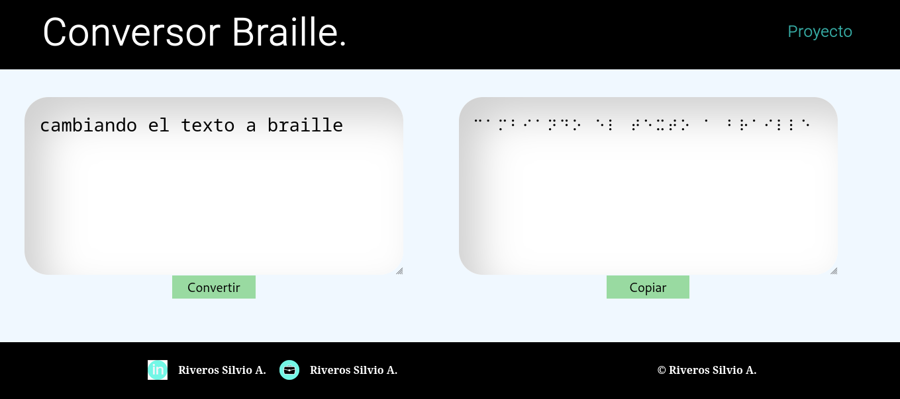

### Nombre del proyecto: Braille.
#### Autor: Riveros Silvio.
#### Tecnologías: HTML, CSS y Javascript.

#### Descripción del proyecto:
- Se trata de una pagina web estática desplegada mediante github_pages, que tiene por objetivo ayudar a personas con familiares no videntes a poder llevar los textos o mensajes a braille.
- Esta es la primera versión del proyecto, que ofrece la funcionalidad de convertir el texto. En un futuro se apunta a poder añadir la posibilidad de convertir inversamente, como así también de poder exportar un pdf con el texto convertido.

#### Una imagen de como se vé en esta primera entrega.
